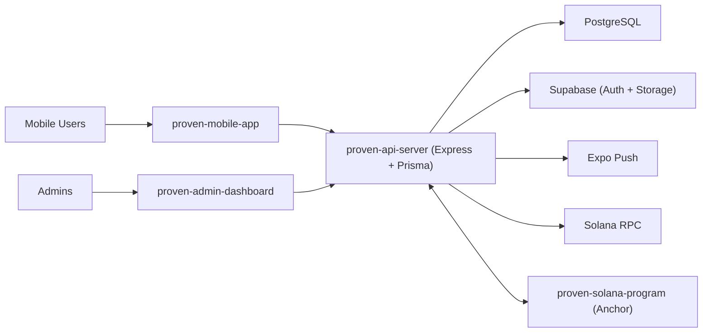

# Proven

Proven is a commitment and accountability platform where users stake funds on personal challenges, submit daily proof, and earn payouts based on consistency.

The system combines:
- Mobile user experience for joining challenges and submitting proofs
- Admin dashboard for moderation and operations
- Backend services for auth, challenge orchestration, payouts, and notifications
- Solana program support for escrow and settlement primitives

## What It Solves

Most habit apps fail at long-term accountability because there is little consequence for dropping off. Proven introduces economic commitment:
- Users stake USDC to join challenges
- Daily proofs are reviewed
- Payouts are distributed based on participation and completion rules

## Core Features

- Google OAuth sign-in for mobile and admin
- Challenge discovery and enrollment
- Solana Pay-based staking flow
- Daily proof upload and moderation
- Daily base payout queue + bonus distribution logic
- Push notification reminders and challenge lifecycle notifications
- Admin operations for disputes, settlements, and challenge closure
- On-chain program for escrow/challenge lifecycle primitives

## Demo Video

- [Watch the demo on YouTube](https://www.youtube.com/watch?v=4xKfWiuMFcI)

## Repository Structure

```text
proven-mobile-app/        Expo React Native app (user-facing)
proven-api-server/        Express + Prisma backend
proven-admin-dashboard/   React + Vite admin panel
proven-solana-program/    Anchor/Solana program + tests
```

## Architecture



## Tech Stack

- Mobile: Expo, React Native, TypeScript
- Backend: Node.js, Express, Prisma, PostgreSQL, Zod
- Admin: React, Vite, TypeScript, Tailwind/shadcn
- Blockchain: Solana, Anchor, SPL Token
- Infra Integrations: Supabase, Expo Push Notifications

## Prerequisites

- Node.js 20+
- npm
- PostgreSQL
- Solana CLI + Anchor (for `proven-solana-program`)

## Quick Start (Local)

Use 4 terminals from repository root.

### 1) API Server

```bash
cd proven-api-server
npm install
cp env.example .env
# Fill required values in .env
npx prisma generate
npx prisma migrate deploy
npm run dev
```

API default: `http://localhost:3001`

### 2) Mobile App

```bash
cd proven-mobile-app
npm install
# Ensure EXPO_PUBLIC_API_URL points to local API if needed
npm run start
```

### 3) Admin Dashboard

```bash
cd proven-admin-dashboard
npm install
cp .env.example .env
# Set VITE_API_URL=http://localhost:3001/api
npm run dev
```

### 4) Solana Program (optional for local chain development)

```bash
cd proven-solana-program
npm install
anchor build
anchor test
```

## Environment Notes

### API (`proven-api-server/.env`)

Key variables (see `env.example` for full list):
- `DATABASE_URL`
- `SUPABASE_URL`
- `SUPABASE_ANON_KEY`
- `SUPABASE_SERVICE_ROLE_KEY`
- `JWT_SECRET`
- `SOLANA_RPC_URL`
- `PROGRAM_ID`
- `USDC_MINT`
- `ESCROW_ENCRYPTION_KEY`
- `CORS_ORIGINS`
- `google_client_id`
- `google_secret`

### Admin (`proven-admin-dashboard/.env`)

- `VITE_API_URL` (example: `http://localhost:3001/api`)

### Mobile (`proven-mobile-app/.env`)

Primary:
- `EXPO_PUBLIC_API_URL`

Optional values are read by app config/services depending on build mode.

## Operational Flows

### Challenge Flow

1. Admin creates challenge
2. User joins and stakes
3. User submits daily proof
4. Admin approves/rejects proof
5. Approval enqueues payout jobs
6. Worker executes payouts
7. Daily settlement computes bonus allocations
8. Challenge closure finalizes outcomes

### Auth Flow

1. Client starts Google OAuth via backend
2. Backend callback verifies Google token
3. Backend issues first-party access token
4. Client uses Bearer token for protected routes

## Scripts Overview

### API (`proven-api-server`)
- `npm run dev` - development server
- `npm run build` - compile TypeScript
- `npm run test` - run tests

### Mobile (`proven-mobile-app`)
- `npm run start` - Expo start
- `npm run ios` / `npm run android`
- `npm run lint`

### Admin (`proven-admin-dashboard`)
- `npm run dev`
- `npm run build`
- `npm run lint`

### Program (`proven-solana-program`)
- `npm run build` (Anchor build)
- `npm run test` (Anchor test)

## API Documentation

Detailed backend API docs:
- `proven-api-server/docs/backend-api.md`

## Deployment

Backend deployment guidance:
- `proven-api-server/deploy/README.md`

## Security Considerations

- Never commit real `.env` files or private keys
- Rotate JWT and encryption secrets regularly
- Restrict CORS and admin access in production
- Keep payout and settlement operations idempotent
